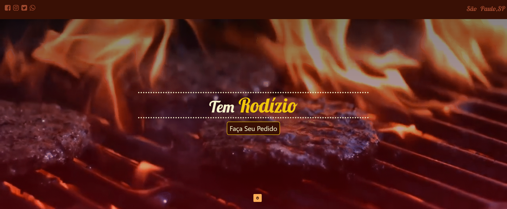

<h1 align="center">Na Brasa</h1>

<p align=" center">Uma single page application desenvolvida durante o curso "Front-end profissional"</p>

#


<div style="display: flex; align-items:center; justify-content:center; gap: 10px;">


</div>

<br />
<br />



<br />

## Tecnologias 🛠

- HTML
- CSS
- JavaScript
- Jquery
- SASS

<br />

## Projeto 🧾

Este foi um projeto , uma single page application desenvolvido durante o curso "Front-end profissional" na Udemy, neste projeto tentei me ater o mais fiel possível ao mockup desenvolvido durante o curso, alterando apenas algumas linhas de código para se adequarem melhor as boas práticas de desenvolvimento utilizadas hoje em dia.

<br />

## Deploy 👀

Deploy da aplicação realizado na <a href="https://na-brasa.vercel.app" alt="Link do deploy">**Vercel**</a>

<br />


## Utilização do projeto 🚀

- No terminal utilize o comando ```git clone https://github.com/hash-luk/na-brasa.git```
- Na pasta atual, instale as dependências necessárias com ```npm install```
- Entre na pasta principal do projeto com ```cd src```
- Abra o arquivo **index.html** no navegador

<br />

## Licença

[MIT]()


#
<p align="center">Desenvolvido com 💜 por Lucas P.</p>